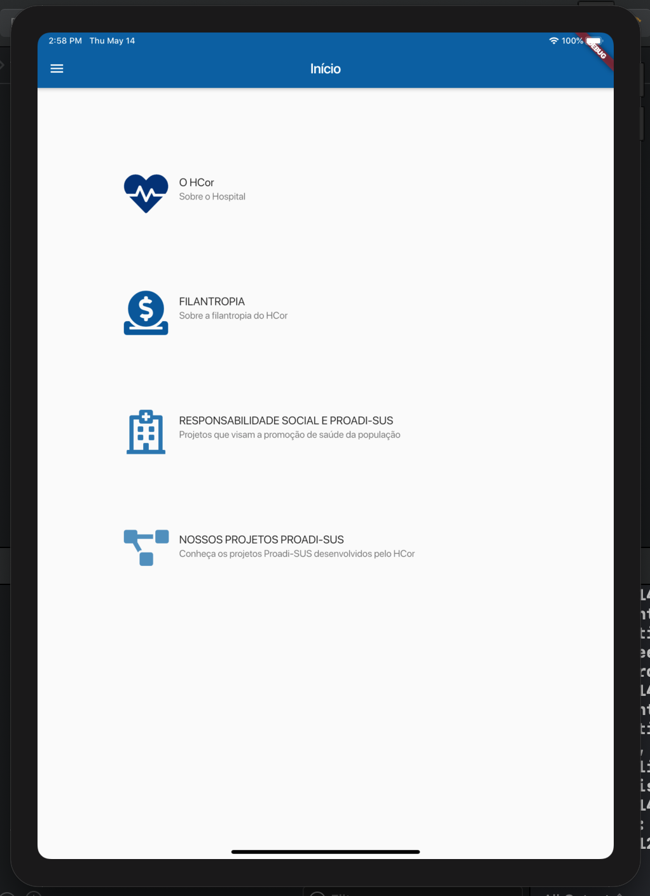
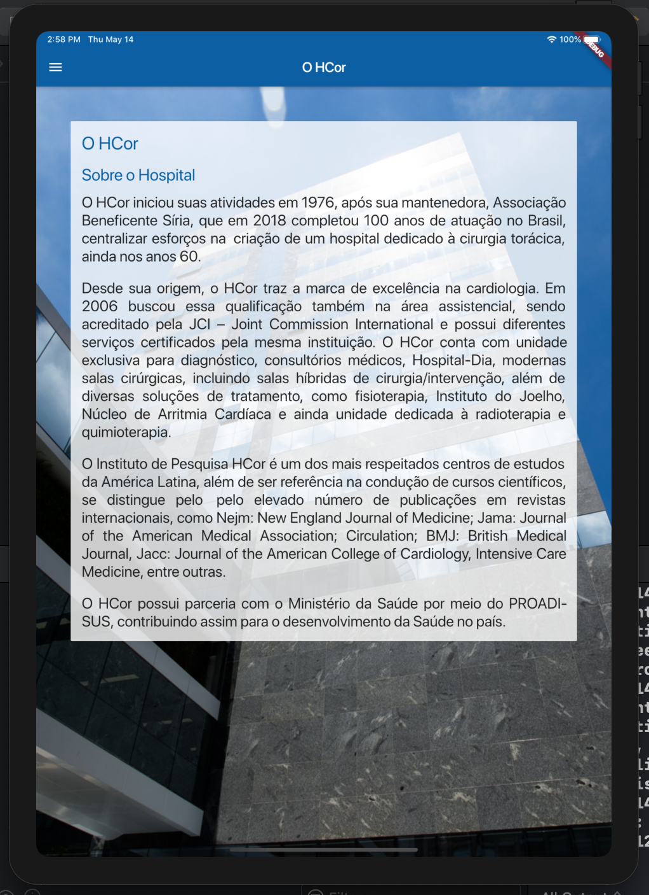
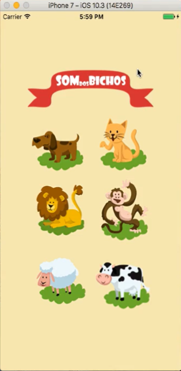
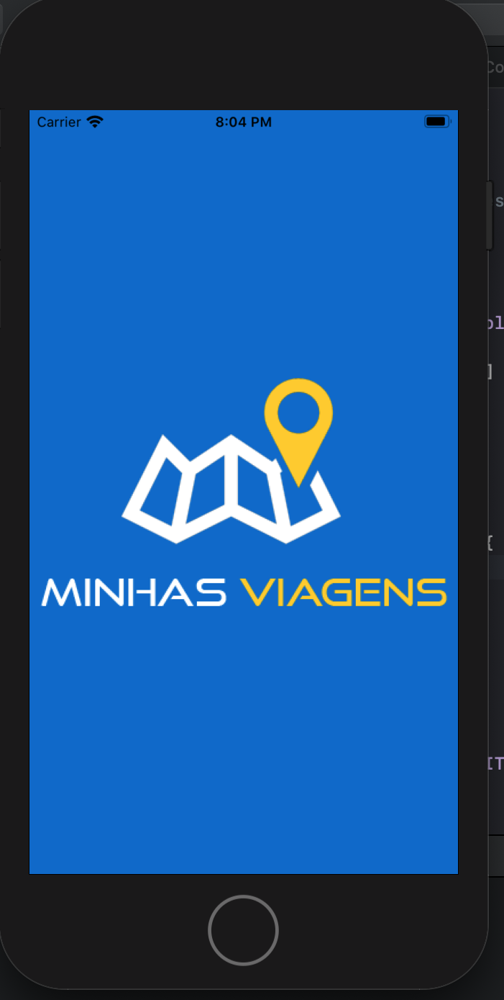
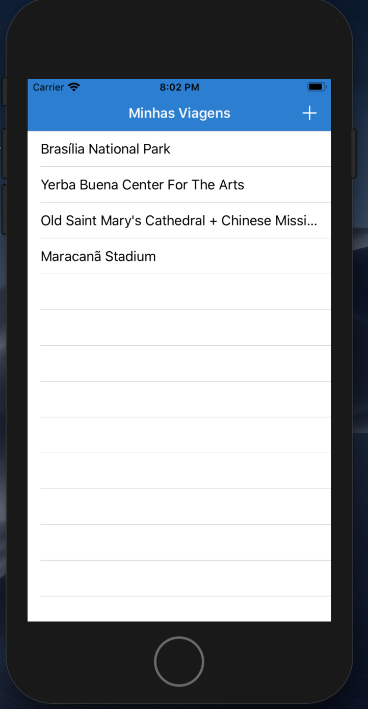
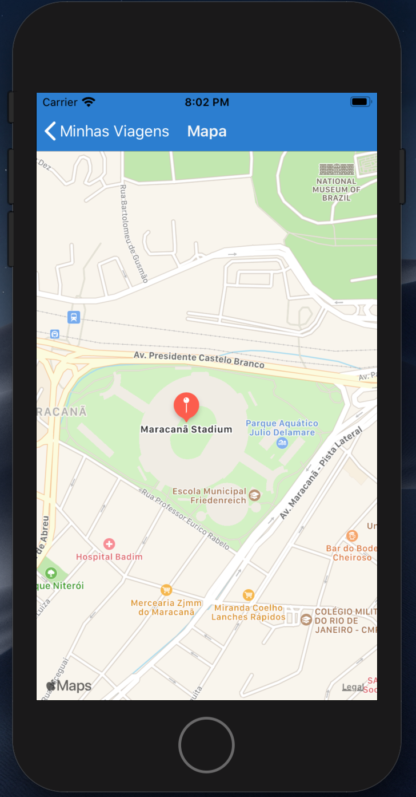
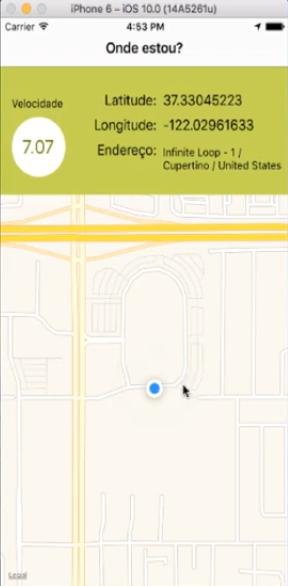

&nbsp;&nbsp;&nbsp;

# IOS-Portfolio

## HCor

Institutional APP (for ipad) developed for the heart hospital of São Paulo/BR.

## Bitcoin Price

A quick and easy way to check the bitcoin price in Brazilian real. This app only consumes a [blockchain](https://www.blockchain.com/api) API to query the bitcoin price in real time.

### Technologies ###
* Swift(4-5)

## Animal Sounds

A Kids APP that plays animal sounds.

### Technologies ###
* Swift(4-5)
* AVFoundation

## Snapchat Clone

A snapchat clone, where pictures are usually only available for a short time before they become inaccessible to their recipients.

### Technologies ###
* Swift(4-5)
* Firebase
* Photos
* Push Notifications

## My Travels

Mark the tourist attractions you want to visit.

### Technologies ###
* Swift(4-5)
* Core Location
* UserDefaults

## My location

Displays user location information.

### Technologies ###
* Swift(4-5)
* Core Location

